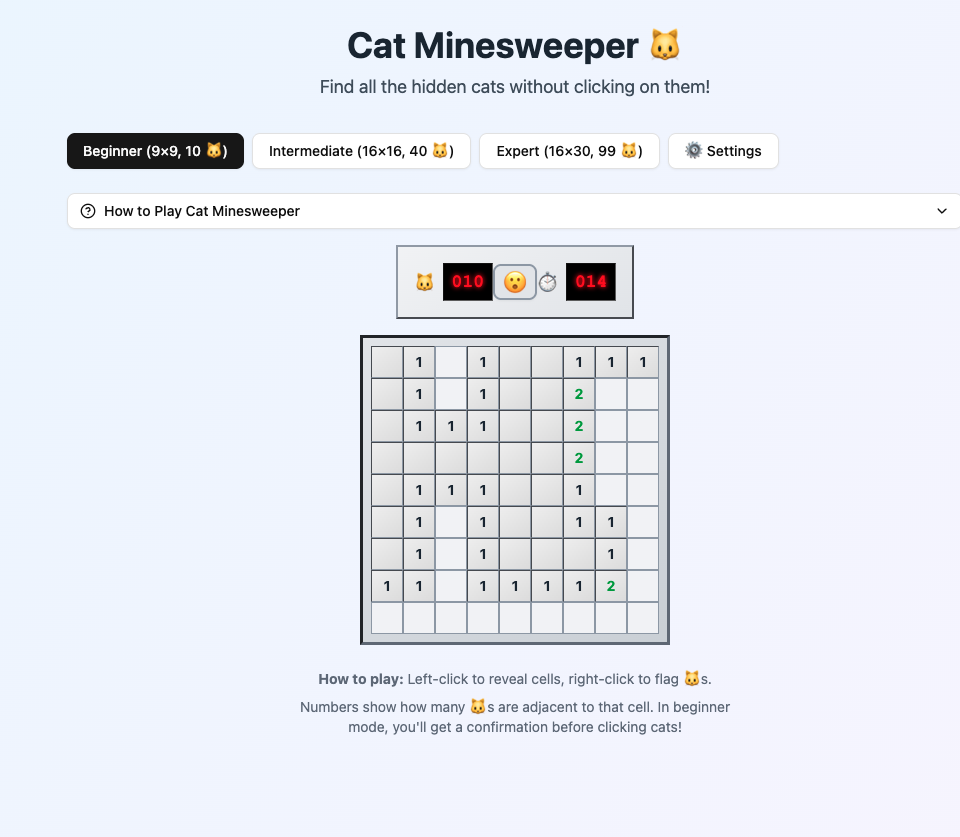

# Cat Minesweeper 🐱

A delightful cat-themed minesweeper game built with React, featuring customizable emojis, multiple difficulty levels, and crystal-clear victory conditions.



## 🎮 Features

### 🐾 **Cat-Themed Gameplay**
- Default cat emoji (🐱) mines with full customization
- 15 preset animal emojis for quick selection
- Custom emoji input for personalized experience
- Theme updates across entire game interface

### 🎯 **Crystal Clear Victory Conditions**
- **Real-time progress indicator** showing exact completion percentage
- **Live cell counting**: "Progress: 24/71 safe cells revealed (47 to go)"
- **Dynamic status messages** guiding players toward victory
- **Spectacular victory celebration** with confetti and statistics

### 🎲 **Multiple Difficulty Levels**
- **Beginner**: 9×9 grid, 10 cats (reveal 71/81 cells)
- **Intermediate**: 16×16 grid, 40 cats (reveal 216/256 cells)
- **Expert**: 16×30 grid, 99 cats (reveal 381/480 cells)

### 🔰 **Beginner-Friendly Features**
- **Confirmation dialog** for cat clicks in beginner mode
- **Comprehensive instructions** with clear win conditions
- **Pro tips** and strategic guidance
- **Visual feedback** with hover effects and animations

### 🎨 **Modern Design**
- **Responsive layout** working on desktop and mobile
- **Smooth animations** and micro-interactions
- **Professional UI** with Tailwind CSS styling
- **Retro minesweeper aesthetics** with modern enhancements

## 🚀 Quick Start

### Prerequisites
- Node.js 18+ 
- pnpm (recommended) or npm

### Installation

```bash
# Clone the repository
git clone <your-repo-url>
cd cat-minesweeper

# Install dependencies
pnpm install
# or
npm install

# Start development server
pnpm run dev
# or
npm run dev

# Build for production
pnpm run build
# or
npm run build
```

### Development Server
```bash
pnpm run dev --host
```
Access the game at `http://localhost:5173`

## 📁 Project Structure

```
cat-minesweeper/
├── public/
│   └── vite.svg
├── src/
│   ├── components/
│   │   ├── ui/                    # Shadcn/ui components
│   │   ├── ConfirmationDialog.jsx # Beginner mode confirmation
│   │   ├── GameBoard.jsx          # Main game grid
│   │   ├── GameHeader.jsx         # Timer, counter, reset button
│   │   ├── GameInstructions.jsx   # How to play panel
│   │   ├── GameSettings.jsx       # Emoji customization
│   │   ├── ProgressIndicator.jsx  # Victory progress tracking
│   │   └── VictoryModal.jsx       # Celebration modal
│   ├── hooks/
│   │   └── useMinesweeper.js      # Core game logic
│   ├── App.jsx                    # Main application
│   ├── App.css                    # Custom styles
│   └── main.jsx                   # Entry point
├── index.html
├── package.json
├── tailwind.config.js
├── vite.config.js
└── README.md
```

## 🎯 How to Play

### Objective
Reveal all safe cells without clicking any cats (mines) to win!

### Controls
- **Left Click**: Reveal a cell
- **Right Click**: Flag/unflag a suspected cat
- **Reset Button**: Start a new game

### Victory Conditions
- **Beginner**: Reveal 71 out of 81 cells (avoid 10 🐱s)
- **Intermediate**: Reveal 216 out of 256 cells (avoid 40 🐱s)
- **Expert**: Reveal 381 out of 480 cells (avoid 99 🐱s)

### Progress Tracking
Watch the progress bar and status messages to see exactly how close you are to victory!

## 🛠️ Technical Details

### Built With
- **React 18.3.1** - UI framework
- **Vite 6.3.5** - Build tool and dev server
- **Tailwind CSS 3.4.17** - Styling framework
- **Shadcn/ui** - UI component library
- **Lucide React** - Icon library

### Key Components

#### `useMinesweeper.js` - Core Game Logic
- Mine generation and placement
- Flood-fill algorithm for cell revelation
- Game state management (READY, PLAYING, WON, LOST)
- Timer and scoring system

#### `ProgressIndicator.jsx` - Victory Guidance
- Real-time progress calculation
- Dynamic status messages
- Visual progress bar
- Clear win condition communication

#### `VictoryModal.jsx` - Celebration Experience
- Confetti animation
- Detailed game statistics
- Performance feedback
- New game options

### Game States
```javascript
const GAME_STATES = {
  READY: 'ready',     // Game initialized, waiting for first click
  PLAYING: 'playing', // Game in progress
  WON: 'won',         // All safe cells revealed
  LOST: 'lost'        // Cat clicked, game over
};
```

## 🎨 Customization

### Emoji Themes
The game supports full emoji customization:
- Default: 🐱 (Cat)
- Preset options: 🐶🐭🐹🐰🦊🐻🐼🐨🐯🦁🐸🐵🐔🐧🦆
- Custom input: Any emoji or combination

### Styling
Built with Tailwind CSS for easy customization:
- Modify `tailwind.config.js` for theme changes
- Custom styles in `App.css`
- Component-level styling with Tailwind classes

## 🚀 Deployment

### Static Hosting
```bash
# Build the project
pnpm run build

# Deploy the dist/ folder to your hosting service
# (Netlify, Vercel, GitHub Pages, etc.)
```

### Environment Setup
No environment variables required - the game runs entirely client-side.

## 🤝 Contributing

1. Fork the repository
2. Create a feature branch (`git checkout -b feature/amazing-feature`)
3. Commit your changes (`git commit -m 'Add amazing feature'`)
4. Push to the branch (`git push origin feature/amazing-feature`)
5. Open a Pull Request

## 📝 License

This project is open source and available under the [MIT License](LICENSE).

## 🎉 Acknowledgments

- Inspired by the classic Minesweeper game
- Built with modern React and Vite
- Enhanced with Tailwind CSS and Shadcn/ui
- Cat theme for maximum enjoyment! 🐱

---

**Enjoy playing Cat Minesweeper!** 🎮✨
